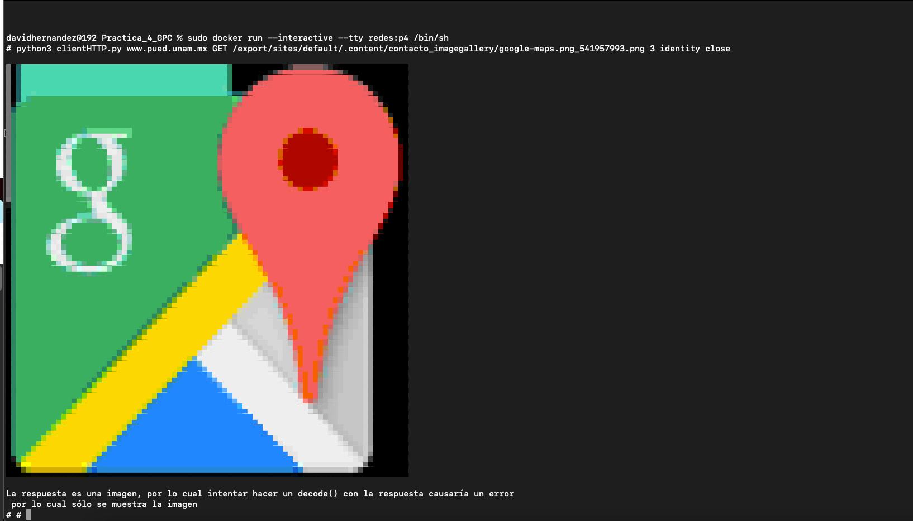
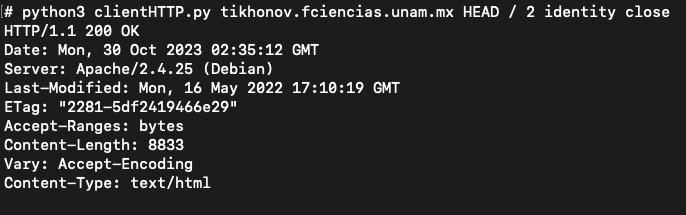
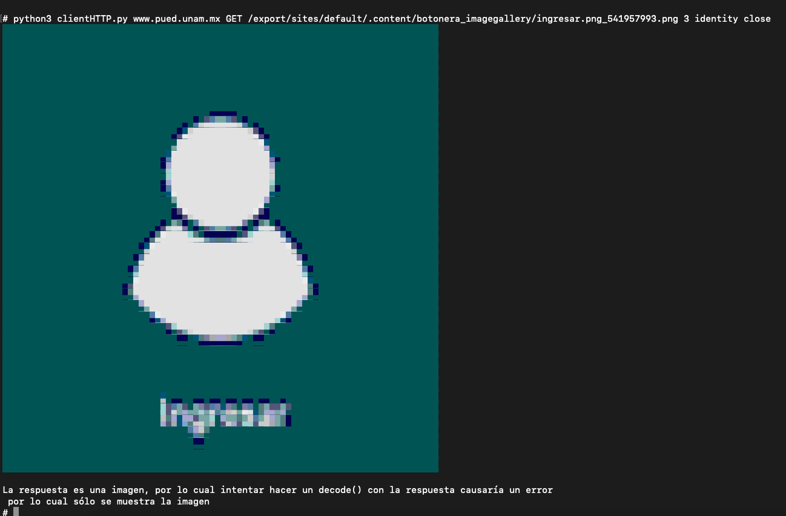
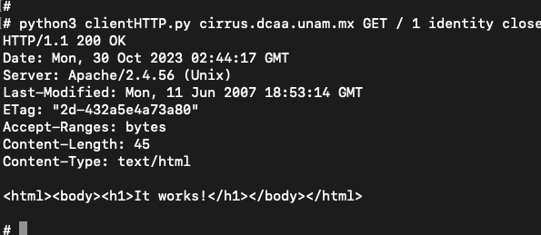

# Practica_4_GPC

[](https://shields.io/)
[](https://github.com/ellerbrock/open-source-badges/)
[](https://shields.io/)  
[](https://www.python.org/)  	

# ¿Cómo correr el programa?

Para poder correr el programa se necesita hacer uso de Docker, para ello se puede descargar y instalar Docker en su computadora, si no lo tiene, puede descargarlo en la siguiente [enlance](https://www.docker.com/get-started).

Una vez instalado se debe correr el siguiente comando:
  ```
  sudo docker build -t nombre_de_la_imagen:etiqueta .  
  ```
Por ejemplo:

  ```
  sudo docker build -t redes:p4 .  
  ```

Una vez instalada la imagen se puede correrla con el siguiente comando:
  ```
  sudo docker run --interactive --tty redes:p4 /bin/sh   
  ```

Dentro de la terminal para ejecutar el programa se debe ejecutar el siguiente comando:
  ```
  python3 clientHTTP.py <host> <http_method> <url> <user_agent> <encoding> <connection>
  ```
Por ejemplo:
  ```
  python3 clientHTTP.py www.pued.unam.mx GET /export/system/modules/mx.unam.pued/resources/images/unam-logo.png 1 identity close
  ```

Para el campo de user_agent se debe seleccionar un número entre el 1 y 3, dónde cada número corresponde a un user agent diferente:

*  Mozilla/5.0 (Windows NT 6.1; Win64; x64; rv:47.0) Gecko/20100101 Firefox/47.3
*  Mozilla/5.0 (X11; Linux x86_64) AppleWebKit/537.36 (KHTML, like Gecko) Chrome/77.0.3865.90 Safari/537.36
*  Mozilla/5.0 (Macintosh; Intel Mac OS X 10_15_7) AppleWebKit/537.36 (KHTML, like Gecko) Chrome/117.0.0.0 Safari/537.36

Para el campo de http_method se puede usar tanto GET como HEAD, si se intenta usar otro método el programa lanzará un error.

De igual manera si no se pasan todos lor argumentos el programa imprimirá en la terminal un mensaje de como se debe usar el programa.


A continuación se puede ver un ejemplo de cómo se puede usar el programa:










# Preguntas

## ¿Cuál es la función de los métodos de HTTP HEAD, GET, POST, PUT y DELETE?

1. **HEAD**: Es parecido GET en cuanto a la petición y la respuesta, pero sin el cuerpo del mensaje. Suele utilizarse para recuperar los headers de un recurso.

2. **GET**: El método GET solicita datos de un recurso especificado. Se utiliza para recuperar información o recursos de un servidor. 

3. **POST**: El método POST se utiliza para enviar datos al servidor para crear un nuevo recurso. Suele utilizarse al enviar un formulario en una página web. 

4. **PUT**: El método PUT se utiliza para actualizar un recurso o crearlo si no existe. A diferencia de POST, que se suele utilizar para crear nuevos recursos, PUT se suele utilizar para actualizar o reemplazar todo el recurso en el URI especificado.

5. **DELETE**: El método DELETE se utiliza para eliminar un recurso de un servidor. 


## Investigue y enliste junto con su significado las categorías de códigos de estado que usa HTTP

Existen cinco categorías (o clases) diferentes de códigos HTTP. Cada una representa un código de respuesta diferente del servidor al navegador.

- **1XX - Códigos informativos:** el servidor acusa recibo y está procesando la solicitud.
- **2XX - Códigos de éxito:** el servidor ha recibido, entendido y procesado correctamente la solicitud.
- **3XX - Códigos de redirección:** el servidor recibió la solicitud, pero hay una redirección a otro lugar (o, en casos raros, debe completarse alguna acción adicional distinta de una redirección).
- **4XX - Códigos de error del cliente:** el servidor no pudo encontrar (o alcanzar) la página o el web. Se trata de un error de web.
- **5XX - Códigos de error del servidor:** el cliente hizo una petición válida, pero el servidor no pudo completarla.


| Código de estado | Función                                     |
|-----------------|--------------------------------------------|
| 1XX - Informativo |                                        |
| 100             | Continúa en                              |
| 101             | Protocolos de conmutación                |
| 102             | Procesando                               |
| 103             | Primeras pistas                          |
| 2XX - Éxito    |                                        |
| 200             | OK                                     |
| 201             | Creado                                 |
| 202             | Aceptado                               |
| 203             | Información no autorizada              |
| 204             | Sin contenido                          |
| 205             | Restablecer contenido                   |
| 206             | Contenido parcial                      |
| 207             | Multiestado                            |
| 208             | Ya comunicado                          |
| 226             | MI Utilizado                           |
| 3XX - Redirección |                                      |
| 300             | Varias opciones                         |
| 301             | Movido permanentemente                   |
| 302             | Encontrado                              |
| 303             | Ver otros                               |
| 304             | No modificado                           |
| 307             | Redireccionamiento temporal             |
| 308             | Redireccionamiento permanente            |
| 4XX - Error de cliente |                                  |
| 400             | Bad request                             |
| 401             | No autorizado                           |
| 402             | Pago requerido                          |
| 403             | Prohibido                               |
| 404             | No se ha encontrado                      |
| 405             | Método no permitido                    |
| 406             | No aceptable                            |
| 407             | Se requiere autenticación proxy         |
| 408             | Tiempo de espera de la solicitud         |
| 409             | Conflicto                              |
| 410             | Gone                                   |
| 411             | Longitud requerida                      |
| 412             | Condición previa fallida                |
| 413             | Contenido demasiado grande              |
| 414             | URI demasiado largo                     |
| 415             | Tipo de soporte no compatible           |
| 416             | Alcance no satisfactorio                |
| 417             | Expectativa fallida                     |
| 421             | Petición mal dirigida                   |
| 422             | Contenido no procesable                 |
| 423             | Bloqueado                               |
| 424             | Dependencia fallida                     |
| 425             | Demasiado pronto                        |
| 426             | Actualización necesaria                |
| 428             | Condición previa requerida             |
| 429             | Demasiadas peticiones                   |
| 431             | Los campos de la cabecera de la solicitud son demasiado grandes |
| 451             | No disponible por motivos legales       |
| 5XX - Error del servidor |                              |
| 500             | Error interno del servidor              |
| 501             | No aplicado                            |
| 502             | Bad gateway                            |
| 503             | Servicio no disponible                  |
| 504             | Tiempo de espera de la puerta de enlace  |
| 505             | Versión HTTP no admitida                |
| 506             | Variante también negociada             |
| 507             | Almacenamiento insuficiente             |
| 508             | Bucle detectado                        |
| 511             | Autenticación de red necesaria          |

## ¿Para qué se usan los campos encoding y connection?

* El header **Accept-Encoding** es utilizado para informar al servidor sobre los tipos de codificación de contenidos que puede entender. La codificación del contenido se refiere a la compresión o transformación de los datos de respuesta antes de ser enviados al cliente.

* El header **Connection** se utiliza para controlar varios aspectos de la conexión de red entre el cliente y el servidor. Puede incluir directivas que especifiquen si la conexión debe mantenerse viva para más peticiones o cerrarse tras el ciclo actual de petición/respuesta. También puede especificar otras opciones relacionadas con la conexión.

# Hecho por:
#### David Hernández Urióstegui - 420003708
#### Luis Mario Escobar Rosales - 420003818


---
 
[](http://ForTheBadge.com)  

